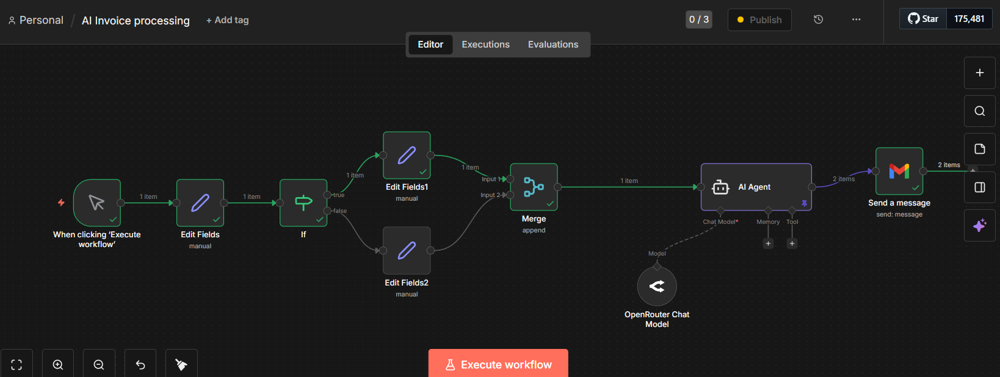

# AI-Invoice-Processing-Automation
AI-powered invoice processing and automated approval workflow using n8n and AI Agent.
# AI-Based Invoice Processing & Automated Approval

## 📌 Project Overview

This project is an AI-powered invoice processing and automated approval workflow developed using n8n.

The workflow processes invoice information, applies business conditions, uses an AI Agent to analyze the invoice data, determines the approval status, and sends an automated email notification.

The main goal is to reduce manual invoice processing and improve efficiency and accuracy.

## 🛠️ Technologies Used

- n8n
- AI Agent
- OpenRouter Chat Model
- Gmail
- Workflow Automation

## 🔄 Workflow

The workflow follows these steps:

1. Invoice details are entered into the workflow.
2. The invoice information is processed using n8n.
3. An IF condition checks the required business conditions.
4. The invoice data is passed to the AI Agent.
5. The AI Agent analyzes and validates the invoice information.
6. The workflow determines the approval status.
7. Gmail automatically sends an email notification.

## 🧾 Sample Invoice

A sample invoice is included in the `sample-invoices` folder to demonstrate the type of invoice information processed by the workflow.

Example:

- Invoice Number: INV-1001
- Vendor Name: ABC Traders
- Amount: ₹15,000
- Status: Approved

## ⚙️ Workflow Diagram

## 🤖 AI Agent

The AI Agent is used to analyze the invoice information and assist in determining the approval status based on the provided conditions and business logic.

## ✨ Key Features

- Automated invoice processing
- AI-based invoice analysis
- Business-rule validation
- Automated approval decision
- Email notification
- Reduced manual intervention
- Improved workflow efficiency

## 🎯 Benefits

- Reduces manual work
- Minimizes human errors
- Speeds up invoice approval
- Improves accuracy
- Automates repetitive business processes

## 🚀 Future Improvements

- PDF invoice data extraction
- OCR for scanned invoices
- Database integration
- Multiple approval levels
- Invoice tracking dashboard
- Payment system integration

## 👩‍💻 Author

**Shaniya**

B.Tech Artificial Intelligence and Data Science
